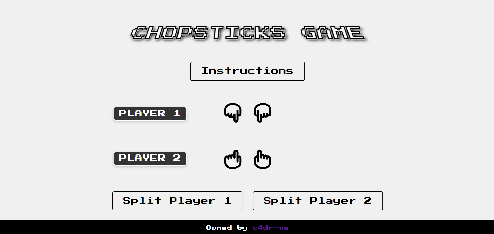

# Chopstick Game

A web-based implementation of the classic hand game "Chopsticks" developed using HTML, CSS, and JavaScript.



## Table of Contents

- [Gameplay](#gameplay)
- [Rules](#rules)
- [Features](#features)
- [Installation](#installation)
- [Future Possibilities](#future-possibilities)
- [Usage](#usage)
- [Instructions](#instructions)
- [License](#license)

## Gameplay

Chopsticks is a two-player hand game where players use their fingers to attack and defend. The game starts with each player having one finger raised on each hand. Players take turns to either attack the opponent or split their fingers between their own hands.

**Note** : In this, game starts whichever hand is clicked first on either player 1 or player 2

## Rules

1. **Starting Position**: Each player starts with one finger raised on each hand.
2. **Turn Options**:
   - **Attack**: Touch one of your hands to one of your opponent's hands, increasing the number of fingers on the opponent's hand by the number of fingers on your hand. If the number of fingers exceeds 4, the hand is considered "dead" and is represented by a fist.
   - **Split**: You can redistribute the fingers between your own hands if the total number of fingers is even and greater than 2, except when both hands already have 4 fingers.
3. **Winning Condition**: The first player to make both of the opponent's hands "dead" (fist) wins the game.

## Features

- Interactive UI for selecting hands and performing attacks.
- Split functionality to redistribute fingers.
- Visual indication of selected hands and turns.
- Simple and intuitive gameplay mechanics.
- Alerts for invalid moves and game over conditions.

## Installation

To run the game locally, follow these steps:

1. **Clone the repository**:

   ```bash
   git clone https://github.com/c4dr-me/chopstick-game.git
   ```

2. **Navigate to the project directory**:

   ```bash
   cd chopstick-game
   ```

3. **Open `index.html` in a web browser**:
   You can simply double-click the `index.html` file, or open it using your browser.

## Future Possibilities

- Implement different variations of the Chopsticks game (e.g., rules with no splitting, 5-finger point, etc.).
- Add a scoring system or levels of difficulty.
- Incorporate multiplayer functionality using sockets or online multiplayer support.

## Usage

- Click on your hand to select it.
- Click on an opponent's hand to attack.
- Use the "Split" buttons to redistribute fingers between your own hands when conditions allow.
- The game will automatically alert and reset when a player wins.

## Instructions

For detailed instructions, please visit the [Instruction Page](https://c4dr-me.github.io/chopstick/instructions.html).

## Live Demo

Play the game live [here](https://c4dr-me.github.io/chopstick-game/).

## License

This project is licensed under the MIT License. See the [LICENSE](LICENSE) file for details.

---

Developed by [c4dr-me](https://github.com/c4dr-me)
